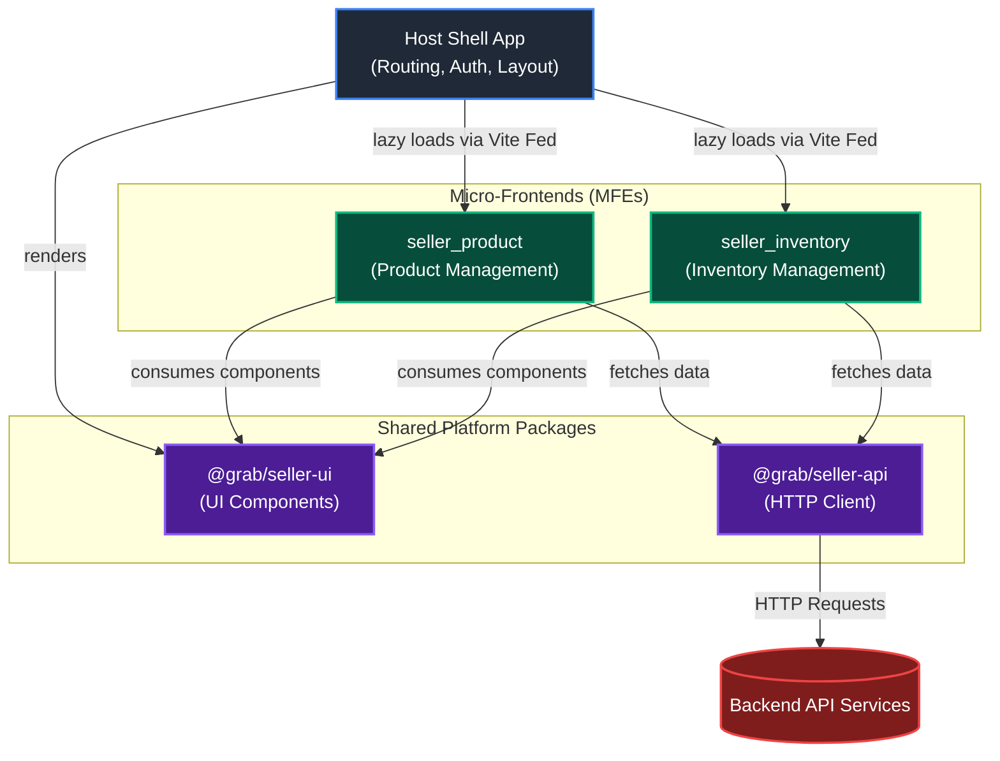

# Seller

This app owns browser routing, and global layout for seller MFEs.

### Package Structure

The codebase provides the global layout and orchestration logic:

```text
src/
├── app/
│   ├── App.tsx                # Root application setup (Providers, Global Router)
│   └── AuthContext.tsx        # Global Authentication State
├── components/
│   ├── AdminSidebar.tsx       # Global navigation sidebar
│   ├── DashboardLayout.tsx    # Layout wrapper for authenticated routes
│   └── RemoteBoundary.tsx     # Suspense & Error Boundary for remote MFEs
├── pages/
│   ├── DashboardPage.tsx      # Main landing page for authenticated users
│   ├── LoginPage.tsx          # Login page
│   └── NotFoundPage.tsx       # 404 page
├── test/                      # Testing setup
├── main.tsx                   # Entry file
├── remotes.d.ts               # TypeScript declarations for remote modules
└── styles.css                 # Global tailwind imports
```

### Architecture Flow

The following diagram illustrates how the Host Shell orchestrates the overall application:



## 🚀 Development

### Running Locally
To run the Shell application locally:
```bash
npm run dev
```
Development expects `seller-product-mfe` on port `3001`, `seller-inventory-mfe` on port `3002`, and the backend API on port `8080`.

### Testing & Building
- **Run Tests**: `npm run test` (powered by Vitest)
- **Typecheck**: `npm run typecheck`
- **Build**: `npm run build` (outputs assets to `dist/`)
- **E2E Tests**: `npm run test:e2e` (powered by Playwright)
