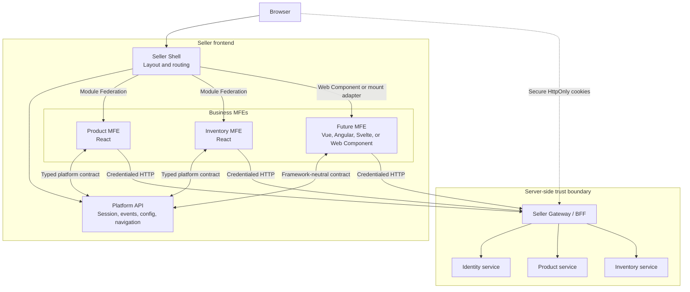
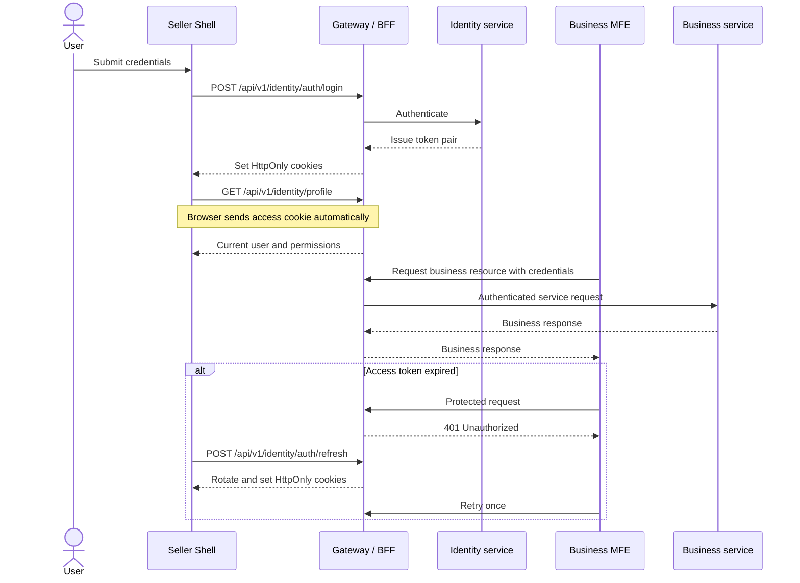

# ADR 001: MFE State, Communication, and Cookie-based Authentication

**Status:** Accepted  
**Date:** 2026-06-21

---

## 1. The Problem

**What's not working?**  
The Seller Shell currently persists the access token and user in `localStorage`, while the shared API client is configured without an access token. The React MFEs also rely on implicit shared runtime context, which does not provide a stable communication boundary for MFEs implemented with another framework.

**What's at stake?**  
Keeping bearer tokens in browser-readable storage allows an XSS vulnerability in the Shell or any loaded MFE to exfiltrate the token. Without explicit state ownership and communication contracts, MFEs can become tightly coupled through shared stores, framework internals, or unversioned events, making independent deployment unsafe.

---

## 2. What We Decided

**The core approach:**  
Use a Shell-owned, framework-neutral Platform API for global frontend concerns; keep business state within its owning MFE or backend; communicate through explicit inputs and versioned events; and use backend-managed `HttpOnly` authentication cookies instead of exposing JWTs to MFEs.

**Key changes:**
- The Shell owns session state, routing, runtime configuration, layout, theme, and other application-wide concerns.
- Each MFE owns its local UI state and server-state cache. The backend remains the source of truth for business entities.
- Parent-child communication uses explicit inputs and callbacks. Cross-MFE business notifications use versioned, framework-neutral events containing identifiers rather than complete entities.
- React MFEs continue to use Module Federation. Non-React MFEs integrate through Web Components or a `mount`/`unmount` adapter and use the same Platform API contracts.
- Authentication uses the backend-issued `accessToken` and `refreshToken` cookies with `HttpOnly`, `Secure`, and an environment-appropriate `SameSite` policy.
- MFEs never read, store, publish, or pass raw access or refresh tokens. Requests are sent with credentials, and the Shell obtains the current user from the authenticated profile endpoint.
- Authentication and authorization remain backend responsibilities. Frontend route guards improve user experience but are not security controls.

**What stays the same:**  
Product and Inventory remain independently deployable MFEs. The Seller gateway continues to provide same-origin routes for the Shell, remote assets, and `/api`. Business communication with backend services remains HTTP-based, and the backend remains authoritative for permissions and business data.

### State ownership and communication rules

| Concern | Owner | Communication mechanism |
|---|---|---|
| Form, modal, selection, and table state | Individual MFE | Internal framework state |
| Product, inventory, and other business data | Backend and owning MFE | HTTP API and MFE-local cache |
| Authentication status and current user | Shell | Read-only session contract/subscription |
| Access and refresh credentials | Backend/BFF | `HttpOnly` cookies only |
| Current route and shareable filters | Shell/URL | Platform navigation API and URL parameters |
| Theme, locale, and runtime configuration | Shell | Read-only Platform API |
| Parent-to-child data | Composing application | Props, attributes, or mount parameters |
| Cross-MFE business changes | Producing MFE | Versioned event with entity identifiers |

Cross-MFE events announce that something happened; they do not replicate a shared database in the browser. For example, `product.updated.v1` carries a `productId`, and a consumer refetches any data it owns that may have changed.

---

## 2.1. Visual Overview

> *Diagrams to understand the architecture at a glance.*

### High-Level Components and Communication

### Authentication Flow

---

## 3. Why This Approach

**Primary reasons:**
1. **Reduced credential exposure:** `HttpOnly` cookies prevent JavaScript from reading and exfiltrating tokens. XSS can still perform actions as the user, so CSP, output encoding, remote integrity controls, and backend authorization remain required.
2. **Framework independence:** The Platform API and event payloads are JavaScript/JSON contracts rather than React Context or a particular state-management library.
3. **Clear ownership:** Local UI state stays local, business data stays backend-owned, and only genuine application-wide concerns live in the Shell.
4. **Independent delivery:** MFEs depend on versioned contracts rather than importing one another or mutating a shared global store.
5. **Backend alignment:** The Identity backend already creates and clears `accessToken` and `refreshToken` cookies and supports cookie-based refresh and logout.

---

## 4. Trade-offs

| Pros | Cons |
|---|---|
| Raw credentials are unavailable to Shell and MFE JavaScript. | Cookie authentication requires correct gateway, domain, HTTPS, `SameSite`, and CORS configuration. |
| MFEs no longer inject or exchange bearer tokens. | The Shell must call the profile endpoint to restore a session after reload. |
| Framework-neutral contracts support React and non-React MFEs. | Platform and event contracts require ownership, versioning, and compatibility tests. |
| State ownership prevents a large shared frontend store. | Consumers may refetch data after an event instead of reusing another MFE's cache. |
| Same-origin gateway routing simplifies browser security configuration. | Cookie-based authentication requires CSRF controls appropriate to the selected `SameSite` policy. |
| Backend-managed token rotation centralizes credential lifecycle. | Refresh requests must be coordinated so concurrent `401` responses do not trigger multiple rotations. |

---

## 5. What Needs to Change

**New components/modules to build:**
- A framework-neutral Platform API contract for session, navigation, runtime configuration, and versioned events.
- Shell session bootstrap using `GET /api/v1/identity/profile`.
- Protected-route handling for authenticated Shell routes.
- A single-flight refresh coordinator that retries an eligible failed request at most once.
- Contract tests covering login, profile restoration, refresh rotation, logout, unauthorized responses, and cross-MFE events.

**Changes to existing systems:**
- Remove `token` from frontend `AuthState` and stop persisting `seller-access-token` and `seller-user` in `localStorage`.
- Update login and logout to rely on cookies set or cleared by `/api/v1/identity/auth/login` and `/api/v1/identity/auth/logout`.
- Keep `credentials: "include"` enabled in the shared API client and remove bearer-token injection from frontend code.
- On logout, clear the shared query cache and notify mounted MFEs through the session contract.
- Namespace MFE query keys and event names to prevent collisions.
- Pass the Platform API explicitly to non-React mount adapters; do not expose Shell implementation details on `window`.
- Complete the server-side authentication path for protected requests. Cookie issuance is already implemented, but the current bearer authentication filter reads only the `Authorization` header. The Gateway/BFF must translate the access cookie into the downstream bearer credential, or the backend authentication filter must securely accept the access cookie.
- Apply CSRF protection for state-changing requests if deployment requirements relax `SameSite=Strict` or introduce cross-site traffic.

**Team impact:**
- Frontend teams treat authentication as a session capability and never handle raw tokens.
- MFE teams publish and consume reviewed, versioned event contracts rather than importing other MFEs or sharing mutable stores.
- Backend and platform teams jointly own cookie attributes, CSRF policy, refresh behavior, and gateway authentication translation.
- Deployment validation must cover production HTTPS and local development, where the backend currently uses `Secure=false` and `SameSite=Lax`.

---

## 6. Migration Plan

- **Phase 1 — Complete the cookie path:** Verify login sets both cookies through the Seller gateway. Implement access-cookie authentication or BFF-to-service bearer translation, then add integration tests for protected API requests, refresh, and logout. Keep the existing JSON token fields temporarily for rollback compatibility.
- **Phase 2 — Migrate the Shell:** Load the current user from the profile endpoint, add protected routes and coordinated refresh, stop reading or writing tokens and users in `localStorage`, and clear cached server state on logout.
- **Phase 3 — Standardize MFE communication:** Introduce the Platform API and versioned events, migrate current React MFEs, add a framework-neutral mount adapter, and remove the compatibility token fields after all consumers have migrated.

**Rollback strategy:**  
During Phases 1 and 2, retain the backend's temporary JSON token response and keep the previous bearer-token client behind a short-lived deployment flag. If cookie delivery or server-side cookie authentication fails, roll the frontend back to the previous client while preserving backend cookie issuance. Do not run both authentication paths indefinitely; remove the fallback and browser token storage after production verification.

---

## 7. Related Documents

- [Backend ADR 013: MFE Communication and Authentication](../../../grab/docs/architecture/decisions/ADR-013-authentication-cookie-session.md)
- [Backend Feature: Identity Cookie Generation](../../../grab/docs/features/FAT-0007_identity-cookie-generation.md)
- [Seller ADR authoring prompt](ADR-prompt.md)
- [Current Shell authentication context](../src/app/AuthContext.tsx)
- [Current shared API client](../../seller-frontend-platform/packages/seller-api/src/client.ts)
